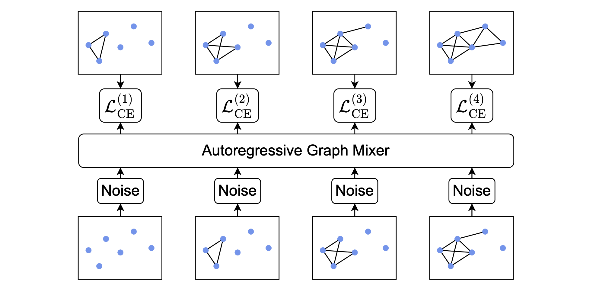
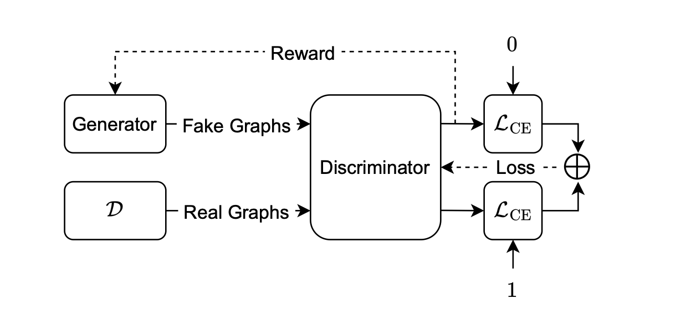

# Autoregressive Noisy Filtration Modeling
[](https://arxiv.org/abs/2502.02415)


This repository contains the official implementation of the ANFM graph generative model:

>Markus Krimmel, Jenna Wiens, Karsten Borgwardt, and Dexiong Chen. [Towards Fast Graph Generation via Autoregressive Noisy Filtration Modeling](https://arxiv.org/abs/2502.02415), Preprint 2025.


## Overview
ANFM models sequences of increasingly dense and detailed graphs. The final graph in a generated sequence should plausibly represent a sample from the target data distribution. Training proceeds in two stages, *teacher-forcing* and *adversarial finetuning*. In the first stage, the model learns from complete graph sequences that are constructed by a filtration strategy. In the second stage, the model is finetuned in free-running mode via reinforcement learning without constraints on intermediate graphs.

<table align="center">
  <tr>
    <td align="center"></td>
    <td align="center"></td>
  </tr>
  <tr>
    <td align="center"><b>Teacher-Forcing (<code>train.py</code>)</b></td>
    <td align="center"><b>Adversarial Finetuning (<code>train_gan.py</code>)</b></td>
  </tr>
</table>

## Installation

Create a conda environment with necessary dependencies:
```bash
conda env create -f environment.yaml
```
Copy the contents of https://github.com/cvignac/DiGress/tree/main/src/analysis/orca (which is a modification of [ORCA](https://github.com/thocevar/orca)) to `anfm/evaluation/orca`.
Then, compile orca by navigating to `anfm/evaluation/orca` and running `g++ -O2 -std=c++11 -o orca orca.cpp`.

Datasets will be automatically cached in a subdirectory of the current working directory called `data`. If applicable, create a corresponding symlink to an appropriate location. 

## Code Structure
This repository contains two main modules, `anfm` and `molecule_labeling`. The former implements our graph generative model, while the latter contains code for post-hoc labeling of nodes and edges. 
Below is the structure of the repository:
```
.
├── anfm/
│   ├── filtration/
│   │   └── ...                     # Various filtration functions and schedules
│   ├── data/
│   │   └── ...                     # Data generation and loading
│   ├── models/
│   │   └── ...                     # Architecture definitions
│   ├── evaluation/
│   │   └── ...                     # Standard MMD metrics
│   ├── configs/
│   │   └── ...                     # Configuration files for training
│   ├── train.py                    # Entry point for teacher-forcing training
│   ├── train_gan.py                # Entry point for adversarial finetuning
│   └── eval.py                     # Entry point for evaluation
└── molecule_labeling/
    ├── train.py                    # Entry point for training
    ├── evaluate_topologies.py      # Entry point for GuacaMol eval of topologies
    └── ...
```

## Training ANFM
Training proceeds in two steps: teacher-forcing and adversarial finetuning. The checkpoint obtained from teacher-forcing is passed to the adversarial finetuning step.
The code is intended to be run on a cluster and is designed to periodically (w.r.t. wall time) create a checkpoint and interrupt training. These interrupts are signaled by the return code `124`. Configure your submission script to restart the job with the exact same command when this occurs. Training will be resumed from the last checkpoint. If you do not require this functionality, you may override the `timelimit` option to be sufficiently large (number of hours between interrupts).


### Teacher-Forcing
The available configuration files are located in `anfm/configs/teacher_forcing`. Launch training with:
```bash
python -m anfm.train --config-name <CONFIG NAME> ++hydra.run.dir=<FIRST RUN DIR> <OVERRIDES>
```
Upon the first run, filtrations will be generated and stored as HDF5 shards in the `data` directory. Subsequent runs with the same filtration strategy and dataset configuration will load these pre-computed filtrations.
The `graph_tool` package is known to cause issues when imported with other packages. In particular, issues may arise in combination with `rdkit`. If you wish to use the GuacaMol dataset, run `python anfm/data/install_raw_guacamol.py` to download necessary data independently of `graph_tool` imports that occur during training. Then, you may start training as detailed above.

#### Configuration Options
Below, we provide a non-exhaustive list of configuration options.
- `wandb`: Parameters controlling logging to Weights & Biases.
- `hyper_parameters`: General training parameters such as LR, batch size, etc.
- `filtration`: Parameters for the filtration strategy.
    - `filtration_size`: The number of steps in the filtration, typically lower than 32.
    - `filtration_fn`: The filtration function, e.g. "dfs_edge_weight" or "line_fiedler".
    - `schedule_fn`: The filtration schedule, e.g. "linear_weight_filtration_v2" or "quantile_filtration".
    - `noise_schedule`: The noise schedule (i.e. the hyperparameter lambda).
- `model`: Parameters controlling the model architecture.
- `num_devices`: Number of GPUs to use. Note that modifying this will affect the global batch size.
- `num_steps`: Number of training steps.
- `dataset`: Parameters for setting up the dataset.
    - `num_repetitions`: How many noisy filtrations to generate for each graph. Increase this if overfitting is observed. 

#### Practical Tips
- Observe the validation loss on Weights & Biases to determine if the model is overfitting.
- Increase the number of dataset repetitions if overfitting is observed. This is especially effective with DFS filtration. 
- When using small datasets with the line Fiedler filtration function, overfitting is likely. In that case, set `dataloading.node_ordering_noise` to be `>0` to randomly perturb positional embeddings derived from the line Fiedler filtration. See `anfm/configs/teacher_forcing/spectre_planar_line_fiedler.yaml` for an example.

### Adversarial Finetuning
The available configuration files are located in `anfm/configs/gan`.
```bash
python -m anfm.train_gan --config-name <CONFIG NAME> ++hydra.run.dir=<SECOND RUN DIR> pretrained_model_folder=<FIRST RUN DIR> pretrained_model_checkpoint=step_<NUM STAGE I STEPS>.ckpt <OVERRIDES>
```

#### Configuration Options
- `pretrained_model_folder`: The folder containing the checkpoint from teacher-forcing.
- `pretrained_model_checkpoint`: The checkpoint from teacher-forcing.
- `discriminator`: Discriminator architecture
- `value_model`: Value model architecture, shares same mixer backbone as generator
- `hyper_parameters`: General training parameters for generator, value model, and discriminator such as LR, batch size, etc.


#### Practical Tips
- Monitor how the discriminator loss (cross entropy) evolves on the training and validation sets. If the validation loss becomes substantially higher than the training loss, the discriminator may be overfitting.
- In case of overfitting of the discriminator, try decreasing the number of layers and the hidden dimension of the discriminator. Decreasing `discriminator_features.random_walk_pe_dim` may also help.
- The generator LR is typically chosen very small (e.g. 1e-7 or 1e-8)
- If you experience oscillations in the generator reward, try lowering the generator learning rate. Try increasing the `num_steps` for the discriminator if the discriminator loss oscillates (may indicate that the discriminator is falling behind).


## Pre-Trained Checkpoints
Coming soon.


## Evaluation
We evaluate topologies generated by ANFM models via the `anfm/eval.py` script. Namely, use the following command to evaluate a model:
```bash
python -m anfm.eval --checkpoint <CHECKPOINT> --n-samples <NUM MODEL SAMPLES, e.g. 1024 > --dump-dir <DIR TO STORE EVAL RESULTS> --batchsize <BATCHSIZE FOR GENERATION> <--test IF TESTING, ELSE VALIDATION> <--gan IF EVALUATING CHECKPOINT FROM ADVERSARIAL FINETUNING, ELSE TEACHER-FORCING> 
```
This will compute various MMD metrics, inference time, and store samples from the model. If you get a CUDA error regarding an `invalid configuration argument`, try lowering the `batchsize`.

To evaluate molecule generation, we first invoke the evaluation script above to generate un-attributed topologies. Then we use `molecule_labeling/evaluate_topologies.py` to perform post-hoc labeling and compute the GuacaMol metrics.
```bash
python -m molecule_labeling.evaluate_topologies --samples <PATH TO EVAL RESULTS>/all_samples.pkl --model <PATH TO VAE CHECKPOINT> --output <OUTPUT JSON FILE>
```


## Customizing ANFM
### Defining Custom Datasets
Take a look at `anfm/data/planar.py` for an example of how to define a dataset. Essentially, one needs to inherit from `anfm.data.base.dataset.AbstractFiltrationDataset` and pass a list of networkx graphs to the superclass constructor. Filtrations are automatically generated and stored in HDF5 shards in the `data` directory. 


### Defining Custom Filtration Strategies
See `anfm/filtration/{fiedler_funtion.py, dfs_function.py, centrality_functions.py}` for examples of how to define filtration functions. A filtration function takes a networkx graph as input and returns a pair consisting of edge weights and node weights. The edge weights are used to construct the filtration sequence, while the node weights are used to sort nodes to obtain positional embeddings.
Import your custom filtration function in `anfm/filtration/__init__.py` to make it available from configuration files.


## Training a Post-Hoc Labeler
Train a VAE to label GuacaMol molecules via:
```bash
python -m molecule_labeling.train ++hydra.run.dir=<RUN DIR>
```